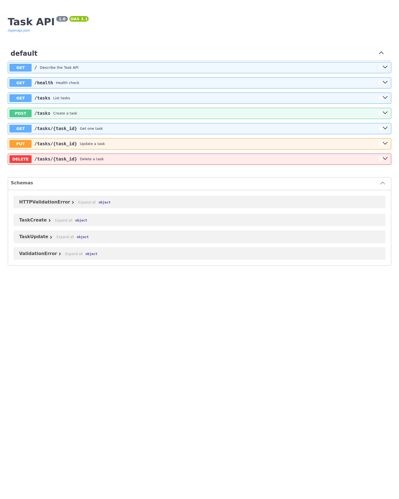

# W2 · A1 — Task CRUD API

A small FastAPI server that manages an in-memory to-do list with full CRUD operations. Data intentionally lives only in memory for Assignment 1 and resets when the process restarts.

## Install and run

Requires Python 3.10+.

```bash
python -m pip install -r requirements.txt
./run.sh
```

The API listens on `http://localhost:8000` and Swagger UI is at `http://localhost:8000/docs`.

## Endpoints

| Method | Path | Success | Purpose |
|---|---|---:|---|
| GET | `/` | 200 | API metadata |
| GET | `/health` | 200 | Health check |
| GET | `/tasks` | 200 | List all tasks |
| GET | `/tasks/{id}` | 200 | Get one task |
| POST | `/tasks` | 201 | Create a task |
| PUT | `/tasks/{id}` | 200 | Update `title` and/or `done` |
| DELETE | `/tasks/{id}` | 204 | Delete a task |

Invalid request bodies return `400` with a JSON `error` message. Unknown task ids return `404` with a JSON `error` message.

## Verified `curl -i` example

```text
### GET /
HTTP/1.1 200 OK
date: Sun, 23 Aug 2026 09:57:56 GMT
server: uvicorn
content-length: 58
content-type: application/json

{"name":"Task API","version":"1.0","endpoints":["/tasks"]}
```

## Swagger UI

The full CRUD cycle was exercised against the final API contract through Swagger UI.



## Tests

```bash
pytest -q
```

The automated suite verifies the exact root/health payloads, in-memory `done` schema, CRUD status codes, JSON error shape, empty PUT rejection, empty 204 response body, and Swagger/OpenAPI descriptions.

## In-memory behavior

Because Assignment 1 deliberately uses in-memory storage, any tasks created while the server is running disappear when the process restarts. Assignment 2 introduces persistent database storage to solve that limitation.
